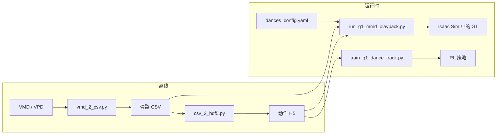

# isaac-RMD

机器人的全身动作数据按照目前主流的采集方式是直接遥操，或者采用开源的动作库。实际上，关于机器人跳舞的动作数据，基于MMD的VMD已经将近有20年的历史沉淀，MMD社区已提供了大量动作数据。


因此，本项目尝试实现在isaacsim里读取VMD动作文件，使用宇树**G1（29 DOF）进行动作重定向与回放的初步功能。**

**目前功能只实现**重定向，基于RSL-RL 的强化学习2sim训练可初步实现，正在调试。当然，整体功能还很不完善，持续改进中……


---

## 项目简介

**isaac-RMD**（`robot_mmd`）在 **NVIDIA Isaac Sim / Isaac Lab** 中，将 **MMD/VMD 骨骼动作**
重定向到 **宇树 G1** 人形机器人。项目覆盖离线转换、带可选伴音的实时回放、仿真内重定向调试 UI，
以及基于 PPO 的舞蹈动作跟踪强化学习。


| 功能               | 说明                                        |
| ---------------- | ----------------------------------------- |
| **MMD → G1 重定向** | VMD/CSV/H5 → 关节角 + 根位姿（Swing-Twist + 轴映射） |
| **交互式回放**        | 快捷键选舞、Pose 循环、足部 IK、关节映射与重定向调参 UI         |
| **RL 舞蹈跟踪**      | Isaac Lab 环境（**C1 为主**，C2 实验）+ RSL-RL PPO 训练 |
|                  |                                           |


---

## 项目状态


| 模块               | 状态            | 说明                                      |
| ---------------- | ------------- | --------------------------------------- |
| MMD 回放与重定向 UI    | **较稳定**       | 主入口：`run_g1_mmd_playback.py`            |
| VMD → CSV/H5 工具链 | **较稳定**       | `vmd_2_csv.py`、`csv_2_hdf5.py`、根 Z 编辑脚本 |
| 站立环境             | **较稳定**       | `Isaac-G1-Stand-v0`，用于回放与冒烟测试           |
| 舞蹈跟踪 RL（C1）      | **活跃开发中**     | **当前主训练任务**：浮动根、腿部残差控制、倒地终止、课程学习 |
| 舞蹈跟踪 RL（C2）      | **实验性**       | 全窗口跟踪、更强根位姿奖励                           |
| 跨平台音频            | **仅 Windows** | WAV 通过 `winsound` 播放；其他平台为 no-op        |


---

## 已注册的 Gym 任务


| 任务 ID                        | 用途                           |
| ---------------------------- | ---------------------------- |
| `Isaac-G1-Stand-v0`          | 平地 A-pose 初始；MMD 回放          |
| `Isaac-G1-Dance-Track-C1-v0` | **主训练/播放任务**：浮动根，腿部在 H5 参考周围学习残差控制 |
| `Isaac-G1-Dance-Track-C2-v0` | 实验：全窗口跟踪 + 动作结束保持               |


---

## 数据流




---

## 目录结构


| 路径                               | 作用                                                 |
| -------------------------------- | -------------------------------------------------- |
| `robot_mmd/my_task/`             | Gym 注册、环境配置（站立 + C1/C2 训练）                     |
| `robot_mmd/train_workflow/`      | 回放、训练、重定向工具、脚本、UI                                  |
| `robot_mmd/media/`               | **仅本地**（gitignore）：`dance/`、`pose/`、VMD/CSV/H5/WAV |
| `assets/`                        | G1 29-DOF O6 手 USD 仿真资产                            |
| `setup_env.sh` / `setup_env.bat` | Isaac Sim **5.1.0** + Isaac Lab **2.3.0** 安装脚本     |


更详细的模块说明：[robot_mmd/OVERVIEW.md](robot_mmd/OVERVIEW.md)

---

## 环境要求

- **NVIDIA Isaac Sim 5.1.0** — [需自行下载](https://developer.nvidia.com/isaac-sim)
- **Isaac Lab 2.3.0** — 通过 [setup_env.sh](setup_env.sh) 或 [setup_env.bat](setup_env.bat) 安装
- **Conda 环境** `env_isaaclab_mmd`（由安装脚本创建）
- **Python ≥ 3.11**
- **PyYAML**（读取 `dances_config.yaml`）

---

## 快速开始

```bash
# 1) 安装 Isaac Sim + Isaac Lab（见 setup_env.*），然后在仓库根目录：
conda activate env_isaaclab_mmd
pip install -e .

# 2) 准备本地媒体与配置：
#    cp robot_mmd/train_workflow/dances_config.example.yaml \
#       robot_mmd/train_workflow/dances_config.yaml
#    将 VMD/CSV/H5/WAV 放入 robot_mmd/media/（见 media/README.md）

# 3) MMD 交互回放
./isaac_workspace/IsaacLab/isaaclab.sh -p robot_mmd/train_workflow/run_g1_mmd_playback.py

# 4) 舞蹈跟踪 PPO 训练（示例）
./isaac_workspace/IsaacLab/isaaclab.sh -p robot_mmd/train_workflow/train_g1_dance_track.py \
  --task Isaac-G1-Dance-Track-C1-v0 --num_envs 2048 --headless \
  --motion_h5 robot_mmd/media/dance/your_motion.h5
```

Windows 上将 `isaaclab.sh` 替换为 `isaaclab.bat`。

### IDE 配置（可选）

```bash
cp pyrightconfig.example.json pyrightconfig.json
# 将 venvPath 改为你的 Conda envs 目录
```

---

## 仓库不包含的内容

本仓库仅提供**源代码**。详见 [THIRD_PARTY_NOTICES.md](THIRD_PARTY_NOTICES.md)。


| 项目        | 说明                                       |
| --------- | ---------------------------------------- |
| Isaac Sim | 需自行下载，受 NVIDIA 许可约束                      |
| Isaac Lab | 从 GitHub 克隆安装                            |
| MMD 动作与音频 | VMD/CSV/H5/WAV — 本地放入 `robot_mmd/media/`（见 [robot_mmd/media/README.md](robot_mmd/media/README.md)） |
| 舞蹈登记配置 | 复制 `robot_mmd/train_workflow/dances_config.example.yaml` → `dances_config.yaml` |


---

## 许可证

本仓库**原创代码**采用 **[Apache License 2.0](LICENSE)**。

部分源自 [Isaac Lab](https://github.com/isaac-sim/IsaacLab) 的文件保留 **BSD-3-Clause**
版权声明与 SPDX 头注释，使用时须遵守相应条款。第三方组件与「需用户自行获取」的内容说明见
[THIRD_PARTY_NOTICES.md](THIRD_PARTY_NOTICES.md)。

---

## 免责声明

- 本项目为**独立开源项目**，与 **NVIDIA**、**宇树（Unitree）** 或 **MMD/PMD 动作及模型版权方**
**无关联、无授权、无背书关系**。
- 本仓库**不包含** Isaac Sim 安装包、Isaac Lab 源码或 MMD 动作/音频数据；使用者须自行获取并
遵守各第三方的许可与版权规定。
- 代码与文档按「现状」（AS IS）提供，**不提供任何明示或默示担保**；因使用本项目而产生的任何
风险或损失由使用者自行承担。

