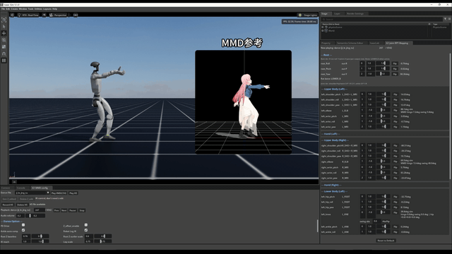
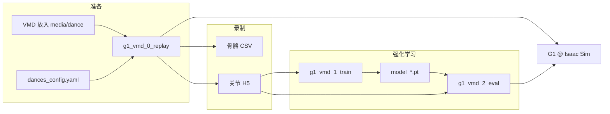

# Isaac-Robot-MMD

在 **NVIDIA Isaac Sim / Isaac Lab** 中，将 **MMD/VMD 骨骼动作** 重定向到 **宇树 G1（29 DOF + O6 手）**，并完成回放调试、H5 录制与 PPO 舞蹈跟踪训练。

## 演示


<p align="center">
  
</p>

（借物表：动作 by Yurie， 参考模型 by Bushiroad Games/BungleScrungle/海新_/小麦弥望）

---

## 项目简介

机器人全身动作的主流来源是WBC遥操、开源动作库或者视频数据逆解析，但 **MMD 社区** 已沉淀近二十年的 VMD 舞蹈资源，数量大、种类多、骨骼关节信息准确。因此，本项目提供一条解析VMD格式源文件（MMD动作数据），导入到IsaacSim进行回放，训练的整条流水线：

1. **VMD → 仿真骨骼 CSV**：自动或手动转换 MMD 动作；
2. **重定向与回放**：在 Isaac Sim 中映射到 G1 关节，支持 UI 微调、足部 IK、伴音同步；
3. **Record H5**：将调试好的轨迹编译为 RL 参考动作数据集；
4. **PPO 训练与验证**：在 Isaac Lab ManagerBased 环境中读取 H5 参考轨迹，用 PPO（RSL-RL） 训练腿部残差跟踪策略checkpoint；
5. **策略2Sim验证**：通过 eval 脚本在仿真中加载 checkpoint，对比 H5 关节跟踪误差。

整条链路围绕三个入口脚本组织（见下节），其余模块（环境注册、重定向算法、UI 等）为它们提供支撑。


| 阶段   | 做什么                                           | 典型产出                         |
| ---- | --------------------------------------------- | ---------------------------- |
| 准备   | VMD 放入 `media/dance/`，登记 `dances_config.yaml` | CSV / 可选 WAV                 |
| 回放调试 | 关节映射、根 Z 修正、Record H5                         | `*.h5` 参考轨迹                  |
| 训练   | 多环境并行 PPO，腿部残差跟踪 H5                           | `logs/rsl_rl/.../model_*.pt` |
| 验证   | 加载 checkpoint，对比参考关节误差                        | 可视化 + 跟踪指标                   |


> 更细的模块说明见 [source/OVERVIEW.md](source/OVERVIEW.md)。

---

## 核心脚本（三步工作流）

日常开发只需关注以下三个文件，按顺序使用：


| 步骤    | 脚本                                                               | 作用                                                                                                                    |
| ----- | ---------------------------------------------------------------- | --------------------------------------------------------------------------------------------------------------------- |
| **0** | `[g1_vmd_0_replay.py](source/train_workflow/g1_vmd_0_replay.py)` | **回放与重定向**：加载 VMD/CSV/H5，交互选舞、Mapping UI、足部 IK、伴音；启动时自动扫描 VMD 并生成 CSV/H5；UI 内 **Record H5** 导出训练用参考轨迹                 |
| **1** | `[g1_vmd_1_train.py](source/train_workflow/g1_vmd_1_train.py)`   | **PPO 训练**：读取 `media/dance/<dance>.h5`，在 `Isaac-G1-Vmd-Train-C1-v0`（默认）上学习腿部残差策略；支持 `--dance`、`--window_frames`、课程学习等 |
| **2** | `[g1_vmd_2_eval.py](source/train_workflow/g1_vmd_2_eval.py)`     | **策略验证**：加载 `logs/rsl_rl/` 下最新或指定 checkpoint，在仿真中播放策略并统计相对 H5 的关节跟踪误差                                                 |


```text
VMD / CSV  ──►  g1_vmd_0_replay  ──►  H5  ──►  g1_vmd_1_train  ──►  checkpoint
                      ▲                                              │
                      └────────────  g1_vmd_2_eval  ◄────────────────┘
```

---

## 数据流




---

## 目录结构


| 路径                                                                | 作用                                                 |
| ----------------------------------------------------------------- | -------------------------------------------------- |
| `[source/train_workflow/](source/train_workflow/)`                | 三个 `g1_vmd_*` 入口、重定向工具、UI、辅助脚本                     |
| `[source/my_task/](source/my_task/)`                              | Gym 环境注册、MDP、机器人与训练配置                              |
| `[media/](media/)`                                                | **仅本地**（gitignore）：`dance/`、`pose/`、VMD/CSV/H5/WAV |
| `[docs/](docs/)`                                                  | 项目文档（本地，gitignore）                                 |
| `[assets/](assets/)`                                              | G1 29-DOF O6 手 USD 资产；`demo/` 存放 README 演示 GIF     |
| `[setup_env.sh](setup_env.sh)` / `[setup_env.bat](setup_env.bat)` | Isaac Sim **5.1.0** + Isaac Lab **2.3.0** 安装       |


---

## 环境要求

- **NVIDIA Isaac Sim 5.1.0** — [需自行下载](https://developer.nvidia.com/isaac-sim)
- **Isaac Lab 2.3.0** — 通过 [setup_env.sh](setup_env.sh) 或 [setup_env.bat](setup_env.bat) 安装
- **Conda 环境** `env_isaaclab_mmd`（安装脚本创建）
- **Python ≥ 3.11**
- **PyYAML**（读取 `dances_config.yaml`）

---

## 快速开始

```bash
# 1) 安装 Isaac Sim + Isaac Lab，然后在仓库根目录：
conda activate env_isaaclab_mmd
pip install -e .

# 2) 准备本地媒体与配置
cp source/train_workflow/dances_config.example.yaml \
   source/train_workflow/dances_config.yaml
# 将 VMD/CSV/H5/WAV 放入 media/（见 media/README.md）

# 3) 回放与重定向（步骤 0）
./isaac_workspace/IsaacLab/isaaclab.sh -p source/train_workflow/g1_vmd_0_replay.py

# 4) PPO 训练（步骤 1）
./isaac_workspace/IsaacLab/isaaclab.sh -p source/train_workflow/g1_vmd_1_train.py \
  --task Isaac-G1-Vmd-Train-C1-v0 --num_envs 2048 --headless \
  --dance ji_le_jing_tu

# 5) 策略验证（步骤 2）
./isaac_workspace/IsaacLab/isaaclab.sh -p source/train_workflow/g1_vmd_2_eval.py \
  --task Isaac-G1-Vmd-Train-C1-v0 --num_envs 1 \
  --dance ji_le_jing_tu --window_frames 2690
```

Windows 上将 `isaaclab.sh` 替换为 `isaaclab.bat`。步骤 5 也可直接用 Conda Python 启动（与 Isaac Lab 环境一致即可）。

### IDE 配置（可选）

```bash
cp pyrightconfig.example.json pyrightconfig.json
# 将 venvPath 改为你的 Conda envs 目录
```

---

## 未来计划的工作:

- [ ] **手部重定向优化**：更准确的重定向一致性
- [ ] **C1 训练稳定性**：提升 `g1_vmd_1_train` 长序列VMD动作数据的跟踪质量和训练效率
- [ ] **C2 实验任务**：完善课程C2的训练链路
- [ ] **VMD镜头数据**：镜头数据兼容
- [ ] **VMD更多参数调整**：toe IK，表情，motion scale，部分关节锁定的动作执行等
- [ ] **PMX暴力导入isaacsim**：PMX转URDF？……真的可以吗？尝试下
- [ ] **Sim2Sim**：更好的policy eval效率，完善sim2im部署UI界面
- [ ] **Sim2Real**：策略导出与真机部署验证（暂无实机喵）
- [ ] **RTX ON**：测试更高的画质（RTX ON），更好的物理解算，堂堂取代Blender（误

---

## 仓库不包含的内容

本仓库仅提供**源代码**。详见 [THIRD_PARTY_NOTICES.md](THIRD_PARTY_NOTICES.md)。


| 项目        | 说明                                                                           |
| --------- | ---------------------------------------------------------------------------- |
| Isaac Sim | 需自行下载，受 NVIDIA 许可约束                                                          |
| Isaac Lab | 从 GitHub 克隆安装                                                                |
| MMD 动作与音频 | 本地放入 `media/`（见 [media/README.md](media/README.md)）                          |
| 舞蹈登记配置    | 复制 `source/train_workflow/dances_config.example.yaml` → `dances_config.yaml` |


---

## 许可证

本仓库**原创代码**采用 **[Apache License 2.0](LICENSE)**。

部分源自 [Isaac Lab](https://github.com/isaac-sim/IsaacLab) 的文件保留 **BSD-3-Clause** 版权声明与 SPDX 头注释。第三方组件与「需用户自行获取」的内容说明见 [THIRD_PARTY_NOTICES.md](THIRD_PARTY_NOTICES.md)。

---

## 免责声明

- 本项目为**独立开源项目**，与 **NVIDIA**、**宇树（Unitree）** 或 **MMD/PMD 动作及模型版权方** **无关联、无授权、无背书关系**。
- 本仓库**不包含** Isaac Sim 安装包、Isaac Lab 源码或 MMD 动作/音频数据；使用者须自行获取并遵守各第三方的许可与 copyright 规定。
- 代码与文档按「现状」（AS IS）提供，**不提供任何明示或默示担保**；因使用本项目而产生的任何风险或损失由使用者自行承担。

