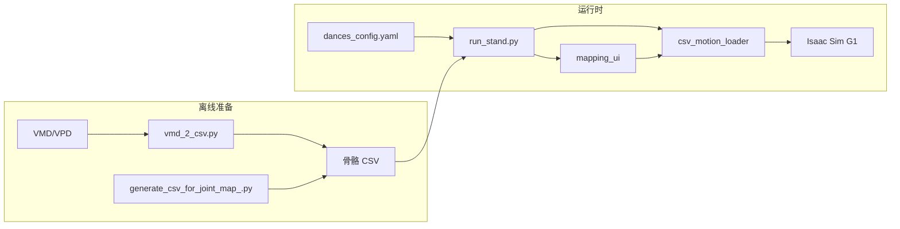

# robot_mmd 总体说明

本文档概括 `robot_mmd` 包的结构、数据流、关键模块与运行方式，并附简要代码检视结论。

---

## 1. 项目定位

本仓库在 **Isaac Lab** 中注册 **宇树 G1（29 DOF）** 的「站立」环境，并通过 **`train_workflow`** 将 **MMD 骨骼动作（CSV）** 回放为仿真中的关节与根位姿，可选 **WAV 伴音**（Windows）与 **关节映射调试 UI**。

- **强化学习环境 ID**：`Isaac-G1-Stand-v0`（`robot_mmd/my_task/__init__.py`）
- **交互演示入口**：`train_workflow/run_stand.py`（键盘触发动画、pose 循环、导出等）

---

## 2. 目录结构（与本文相关部分）

| 路径 | 作用 |
|------|------|
| `robot_mmd/my_task/` | Gym 注册、`G1StandEnvCfg` 场景与 MDP、`RSL-RL` 占位配置 |
| `robot_mmd/train_workflow/` | MMD→仿真流水线脚本与库 |
| `robot_mmd/media/` | 资源根目录：`dance/`、`pose/` 等；YAML 中路径相对此目录 |
| `robot_mmd/train_workflow/dances_config.yaml` | 舞蹈登记：按键、CSV、可选音频 |

---

## 3. 数据流总览



1. **离线**：用 `vmd_2_csv.py` 将 VMD/VPD 转为四元数列 CSV；或用 `generate_csv_for_joint_map_.py` 生成映射测试动作。
2. **配置**：在 `dances_config.yaml` 中为每个舞蹈绑定单字符键、`motion`（相对 `media/`）、可选 `audio`。
3. **运行**：`run_stand.py` 启动 Isaac、加载环境、监听键盘；播放时按 30 FPS（`VMD_FPS`）与 `play_speed` 推进帧，将 MMD 骨骼插值后经 **Swing-Twist + 轴映射** 转为 G1 关节角，并同步根平移/朝向。

---

## 4. 核心模块说明

### 4.1 `run_stand.py`（主程序）

- **职责**：`AppLauncher` 启仿真；创建 `Isaac-G1-Stand-v0`；`Se3Keyboard` 绑定按键；主循环内驱动动作与 `env.step`。
- **舞蹈**：从 `dances_config.yaml`（默认同目录下的 `dances_config.yaml`，常量 `DANCES_CONFIG_PATH`）读取；需 **`PyYAML`**，否则抛清晰 `ImportError`。
- **Pose 循环**：`media/pose/` 下 CSV，`--pose_cycle_key`（默认 `P`）按文件名顺序切换。
- **动作回放模式**：`--motion_playback`（默认开）：不固定根、关重力、增阻尼等（见脚本内逻辑）。
- **根位姿**：从 CSV 的 `グルーブ` / `センター` 等骨骼取平移（带 `--groove_pos_to_world` 缩放）；旋转候选含 `グルーブ`、`センター親`、`腰` 等。对「位移写在センター、グルーブ静态」的数据会自动优先 `センター` 平移。
- **控制**：每帧 `write_joint_state_to_sim` + 关节位置 action，并维护 `joint_pos` 的 `_offset`，避免 zero action 把姿态拉回旧默认。
- **导出**：`--export_isaac_csv` 在一段播放结束后导出 Isaac 侧根姿（**wxyz**）与关节角（弧度）到 CSV。

### 4.2 `csv_motion_loader.py`

- **职责**：读 CSV（欧拉或 **xyzw 四元数** 列）；缺帧插值；`build_joint_positions_from_frame` 将骨骼字典转为 G1 关节向量。
- **约定**：文件列 `quat_x…w` 为 **xyzw**；内存骨字典用 **`quat_wxyz`**，与 Isaac `root_state` 一致。
- **映射表**：由 `g1_joint_axis_map_raw.G1_JOINT_AXIS_MAP_RAW` 展开；支持运行时覆盖（供 UI）。
- **膝/肘**：可选将 MMD 非铰链分量吸收到父骨（`--mmd_knee_hinge_projection` / `BooleanOptionalAction`），便于单轴膝关节表现。

### 4.3 `g1_joint_axis_map_raw.py`

- **职责**：紧凑表：**G1 关节名 → (MMD 骨骼名或 [肩,腕] 列表, 轴索引 0/1/2, 缩放)**。
- 肩/腰等链式骨骼在 loader 中组合四元数后再抽轴角。

### 4.4 `trans_util.py`

- **职责**：**wxyz** 四元数运算、归一化、乘积；`mmd_root_offset_quat_to_world` 等与根朝向复合相关的工具（与 CSV/仿真根对齐）。
- **注意**：任何与 `root_state_w` 列 3–6 交互的代码须使用 **wxyz**（见仓库内 skill `isaac-root-state-quaternion-wxyz`）。

### 4.5 `mapping_ui.py`

- **职责**：在 Isaac Sim 窗口菜单注册 **「G1 Joint Mapping」**；在线改欧拉主轴索引与缩放；显示当前关节角（度）；膝/肘可显示 hinge 分解附加行。
- 映射变更通过回调触发主循环在「暂停态」下按最后一帧重算姿态。

### 4.6 `vmd_2_csv.py`

- **职责**：解析 VMD 骨骼关键帧、VPD 单帧；导出 `frame,bone,pos_*,quat_*`（**文件内 quat 仍为 xyzw 列名与顺序**）。

### 4.7 `audio_util.py`

- **职责**：**Windows** 下 `winsound` 异步播放/停止 WAV；非 Windows 为 no-op 并打印警告。

### 4.8 `reduce_wav_gain.py`

- **职责**：16-bit PCM WAV 整体乘增益另存，便于降低伴音响度；默认输入可在脚本内指向 `media/dance/` 下某文件。

### 4.9 `generate_csv_for_joint_map_.py`

- **职责**：生成按时间块单骨骼 0°→90° 的测试 CSV，用于快速肉眼验证上半身映射。

### 4.10 `my_task/g1_stand_env_cfg.py`

- **职责**：平地、G1（`G1_29DOF_CFG`）、**T-pose 风格初始关节**、最小观测/奖励/终止；`episode_length_s` 设为极大以便长时间演示；`sim.dt` 与 `decimation` 与 Lab 默认管线一致。

### 4.11 `my_task/agents/rsl_rl_ppo_cfg.py`

- **职责**：占位 PPO 配置，满足 `gym.register` 对 `rsl_rl_cfg_entry_point` 的要求；零动作演示不依赖训练。

---

## 5. 配置文件：`dances_config.yaml`

- **`dances`**：列表项含 `key`（单字符）、`motion`（相对 `media/`）、可选 `audio`、可选 `id`（日志用）。
- 同一 `key` 重复时后项忽略（见 `_load_dances_from_yaml` 日志）。

---

## 6. 运行示例

在已配置 **Isaac Lab** 的 Python 环境中，将工作区根目录加入 `PYTHONPATH`（`run_stand.py` 已尝试加入仓库根），例如：

```bash
python robot_mmd/train_workflow/run_stand.py
```

常用参数（完整列表见 `run_stand.py` 内 `argparse`）：

- `--play_speed`：播放倍速  
- `--groove_pos_to_world`：根骨平移到米制缩放（默认 `0.1`）  
- `--export_isaac_csv path.csv`：片段播放结束后导出  
- `--no-mmd_knee_hinge_projection`：关闭膝铰链投影  

**舞蹈 YAML 依赖**：`pip install pyyaml`（若未安装，启动加载配置时会报错提示）。

---

## 7. 代码检视（简要）

| 方面 | 说明 |
|------|------|
| **结构** | 数据路径清晰：离线 `vmd_2_csv` / 运行时 `csv_motion_loader` + `run_stand`；四元数约定在 loader 首部与 `trans_util` 中明确。 |
| **健壮性** | 根骨骼缺失、API 不支持 `write_root_state` / `write_joint_state` 时有降级与一次性告警；动作切换时停音频、重置控制参考，避免姿态回弹。 |
| **平台** | 音频仅 Windows `winsound`；跨平台需替换实现或接受无音频。 |
| **依赖** | `dances_config.yaml` 依赖 PyYAML；与 Isaac 版本强绑定，需在目标 Lab 版本下验证。 |

整体而言，**`train_workflow` 面向「MMD CSV → G1 仿真回放与映射调试」闭环完整**；若需生产级多平台音频或 CI，可再剥离 I/O 与纯数学单元测试。

---

## 8. 相关根目录文件

- 仓库根 `README.md` 当前仅为短标题；详细 workflow 以本文与各模块文件头 docstring 为准。
- `targets.csv` 可为 `--export_isaac_csv` 导出结果，具体列格式见 `run_stand.py` 中 `_write_isaac_applied_motion_csv`。

---

*文档生成依据仓库内源文件结构与注释；参数与路径以当前代码为准。*
